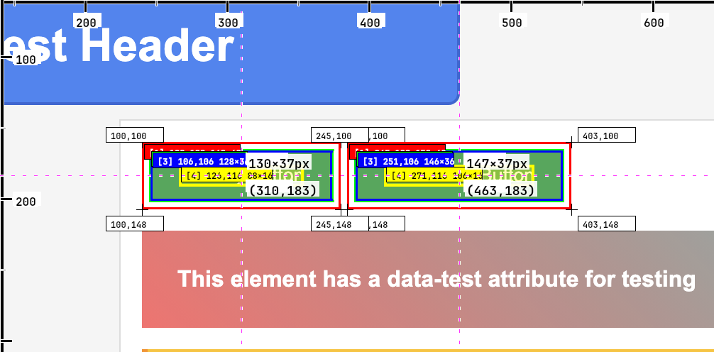
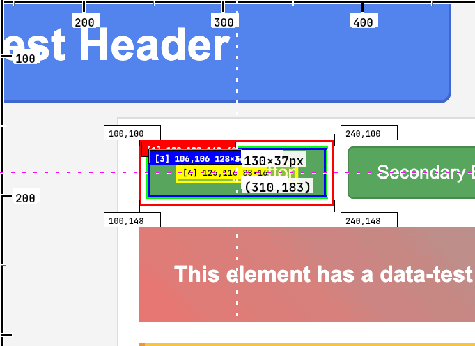
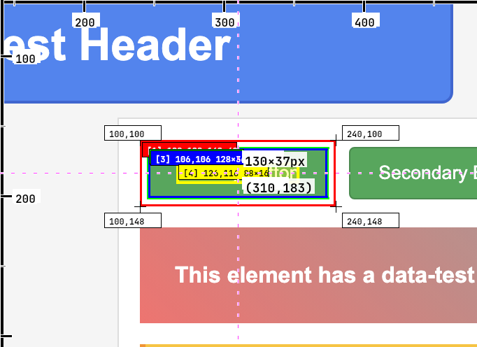
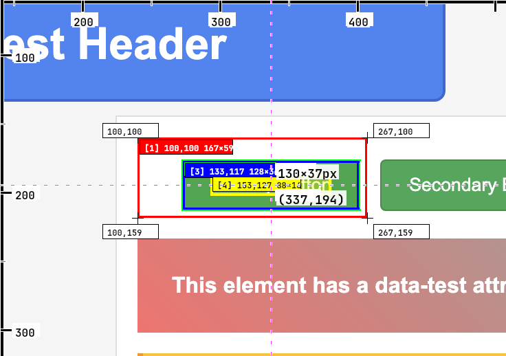

# SARGEL

<div align="center">
  <picture>
    <source media="(prefers-color-scheme: dark)" srcset="wordmark-light-full.svg">
    <source media="(prefers-color-scheme: light)" srcset="wordmark-dark-full.svg">
    
  </picture>
</div>

<div align="center">
  <a href="https://www.npmjs.com/package/sargel">
    
  </a>
  <a href="https://opensource.org/licenses/MIT"></a>
  <a href="https://nodejs.org/">
    
  </a>
  
</div>

**Visual-first CSS debugging for AI agents. See your UI, test changes visually, iterate until pixel-perfect.**

The MCP server that gives AI agents the ability to inspect, test, and perfect your UI visually - just like using browser DevTools, but designed for design iteration and CSS debugging.



---

## Why SARGEL?

**The Problem:** Getting CSS exactly right is hard. Designs don't match implementation, spacing is off by pixels, colors are slightly wrong. The usual fix: back-and-forth screenshots, trial and error, and "close enough" compromises.

**The Solution:** AI agents that can **see your UI visually**, understand what's wrong, **test CSS fixes instantly with before/after screenshots**, and iterate until pixel-perfect - all without touching your source code.

### What Makes SARGEL Different

While tools like [Chrome DevTools MCP](https://github.com/google/chrome-devtools-mcp) excel at runtime debugging (performance traces, console logs, network inspection), **SARGEL is purpose-built for visual design work**:

- **Visual CSS Testing** - Test style changes and see results immediately with screenshot comparisons
- **Design-Focused Inspection** - Computed styles, box model visualization, CSS cascade analysis
- **Visual Interaction** - Click and scroll tools that show you what happened visually, not just programmatically
- **Pixel-Perfect Iteration** - Refine CSS until it matches your design perfectly, then copy working code to source

**Use SARGEL for:** CSS debugging, design-to-code accuracy, visual QA, UI iteration
**Use Chrome DevTools MCP for:** Performance optimization, runtime errors, network debugging

They're complementary tools for different aspects of web development.

---

## How It Works



### The Visual CSS Debugging Workflow

1. **Inspect** - AI sees current state: computed styles, box model, visual issues
2. **Test** - Apply CSS edits and get instant screenshot showing changes
3. **Compare** - See before/after visually to verify the fix
4. **Iterate** - Refine CSS until pixel-perfect
5. **Apply** - Copy working CSS to your source code

**The key insight:** Test changes visually before touching source code. No build steps, no deploy, just instant visual feedback.

---

## Use Cases

### For Frontend Developers
- **Debug CSS issues visually** - See computed styles, test fixes with instant visual feedback
- **Match designs pixel-perfect** - Iterate on spacing, colors, typography until exact
- **Verify responsive behavior** - Check how elements look at different viewport sizes
- **Test interactions** - Click buttons, scroll to elements, see visual results

### For UI/UX Designers
- **Validate implementation** - Verify developers implemented your designs correctly
- **Quick visual QA** - Spot CSS issues and suggest specific fixes with screenshots
- **Design handoff** - Get exact CSS values from implemented components
- **Iterate on live pages** - Test design tweaks on production without engineering

### For Product Teams
- **Visual regression testing** - Catch unintended UI changes before users see them
- **Cross-browser QA** - Verify UI consistency across browsers
- **Accessibility checks** - Inspect focus states, contrast ratios, layout structure
- **Stakeholder reviews** - Get visual proof of CSS fixes and improvements

---

## Example: Fixing Button Spacing

**Problem:** "The submit button is too close to the form fields"

```javascript
// Step 1: Inspect current state
{
  "tool": "inspect_element",
  "arguments": {
    "css_selector": ".submit-btn",
    "url": "https://myapp.com/form"
  }
}
// Returns: Screenshot + computed styles showing margin-top: 4px

// Step 2: Test a fix with visual preview
{
  "tool": "inspect_element",
  "arguments": {
    "css_selector": ".submit-btn",
    "url": "https://myapp.com/form",
    "css_edits": {
      "margin-top": "16px"
    }
  }
}
// Returns: Updated screenshot showing improved spacing

// Step 3: Iterate until perfect
{
  "css_edits": {
    "margin-top": "20px"
  }
}
// Returns: Perfect spacing confirmed visually

// Step 4: Apply to source code
// Add margin-top: 20px to .submit-btn in your CSS
```




*Before and after: Visual iteration until pixel-perfect*

---

## API Reference

### Tools

#### `inspect_element`
Visually inspect elements with computed styles, box model, and optional CSS testing.

| Parameter | Type | Description |
|-----------|------|-------------|
| `css_selector` | string | CSS selector for target element(s) |
| `url` | string | Webpage URL to inspect |
| `css_edits` | object | **Test CSS changes** and see visual results before applying to source |
| `property_groups` | array | Focus on specific groups: "layout", "box", "typography", "colors", "visual", "positioning" |
| `limit` | number | Max elements when selector matches multiple (1-20, default: 10) |
| `autoZoom` | boolean | Auto-adjust zoom for optimal element visibility (default: true) |
| `autoCenter` | boolean | Center elements in viewport (default: true) |

**Returns:**
```typescript
{
  screenshot: string;          // Base64 PNG with Set-of-Mark visual highlights
  computed_styles: object;     // Actual CSS property values from browser
  cascade_rules: array;        // CSS rules in cascade order
  box_model: object;          // margin, padding, border, content dimensions
  applied_edits?: object;     // CSS edits that were tested (if provided)
  viewport_info: object;      // viewport dimensions and scroll position
}
```

#### `click_element`
Click an element and return a screenshot showing the result.

| Parameter | Type | Description |
|-----------|------|-------------|
| `css_selector` | string | CSS selector with optional index: `.button[0]`, `#submit` |
| `url` | string | Webpage URL |

**Returns:**
```typescript
{
  clicked_element: {
    selector: string;           // Selector used
    index: number;              // Which element was clicked (0-indexed)
    coordinates: {x, y};        // Exact click coordinates
    description: string;        // Text content of clicked element
  },
  matched_elements?: {          // If multiple matches found
    total: number;
    elements: [{selector, text}];
  },
  screenshot: string;           // Visual result after click
}
```

**Index Syntax:** Use `button[0]` for first button, `.nav-item[2]` for third nav item. Omit index for unique selectors.

#### `scroll_element`
Scroll to an element and return a screenshot, leaving page positioned for subsequent operations.

| Parameter | Type | Description |
|-----------|------|-------------|
| `css_selector` | string | CSS selector with optional index |
| `url` | string | Webpage URL |

**Returns:**
```typescript
{
  scrolled_element: {
    selector: string;
    index: number;
    scroll_delta: {x, y};                    // How much the page scrolled
    final_position: {x, y, width, height};   // Element position after scroll
    description: string;
  },
  viewport_info: {
    scroll_position: {x, y};                 // Final scroll position
    size: {width, height};
  },
  matched_elements?: {...},
  screenshot: string;
}
```

---

## Visual Design Features

### Set-of-Mark Highlighting
SARGEL uses color-coded visual overlays optimized for AI visual comprehension:
- **Blue border** - Content box
- **Green overlay** - Padding area
- **Yellow overlay** - Border area
- **Orange overlay** - Margin area

AI agents can visually understand box model and spacing at a glance.

### Multi-Element Inspection
When your selector matches multiple elements, SARGEL shows all matches with numbered indicators, helping AI agents understand context and disambiguate targets.

### Screenshot Quality
- High-resolution PNG screenshots
- Auto-zoom for small elements
- Auto-center for optimal visibility
- Configurable viewport dimensions

---

## Installation & Setup

### Prerequisites
- Node.js 18+
- Chrome/Chromium browser
- AI agent with MCP support ([Claude Desktop](https://claude.ai/desktop), [Continue](https://continue.dev), [Cline](https://github.com/cline/cline), etc.)

### Quick Start

1. **Install SARGEL:**
```bash
npm install -g sargel
```

2. **Configure your MCP client** (example for Claude Desktop):

Edit `~/Library/Application Support/Claude/claude_desktop_config.json`:
```json
{
  "mcpServers": {
    "sargel": {
      "command": "npx",
      "args": ["sargel"]
    }
  }
}
```

3. **Restart your AI agent** and start debugging visually!

---

## Technical Architecture

**Core Technology:**
- **Model Context Protocol (MCP)** - Standard interface for AI tool integration
- **Chrome DevTools Protocol (CDP)** - Browser automation and inspection
- **Puppeteer** - Reliable browser control and screenshot capture
- **Canvas Rendering** - Visual highlight overlays with CanvasKit

**Design Patterns:**
- Strategy pattern for single vs. multi-element inspection
- Shared interaction wrapper for consistent DOM operations
- Template method for browser script injection
- Singleton browser instance for performance

**Why Chrome DevTools Protocol?**
CDP provides accurate computed styles, precise box model data, and reliable cross-browser rendering - essential for pixel-perfect visual debugging.

---

## Comparison: SARGEL vs Chrome DevTools MCP

| Capability | SARGEL | Chrome DevTools MCP |
|-----------|--------|-------------------|
| **Primary Use Case** | Visual CSS debugging & design QA | Runtime debugging & performance |
| **Visual CSS Testing** | Yes - Test changes with before/after screenshots | No - No visual CSS preview |
| **Computed Styles** | Yes - Full cascade analysis | Yes - Via evaluate script |
| **Box Model Visualization** | Yes - Color-coded Set-of-Mark overlays | No - Text data only |
| **Click & Scroll** | Yes - Returns visual screenshots | Yes - Programmatic only |
| **Console Logs** | No | Yes - Full access |
| **Network Inspection** | No | Yes - Requests & responses |
| **Performance Tracing** | No | Yes - Lighthouse-style metrics |
| **Target Audience** | Frontend devs, UI/UX designers, product teams | Full-stack engineers, performance specialists |

**Use both:** SARGEL for design and CSS, Chrome DevTools MCP for runtime and performance.

---

## Roadmap

- **Accessibility inspection** - ARIA roles, contrast ratios, focus indicators
- **Responsive testing** - Multiple viewport sizes in single request
- **CSS diffing** - Compare computed styles across elements or pages
- **Animation debugging** - Capture and analyze CSS animations/transitions
- **Design token extraction** - Pull colors, spacing, typography into design systems
- **Cross-browser support** - Firefox and Safari via WebDriver BiDi

---

## Contributing

SARGEL is 100% AI-generated and welcomes contributions! Whether you're fixing bugs, adding features, or improving documentation, your help makes visual debugging better for everyone.

See [CONTRIBUTING.md](CONTRIBUTING.md) for guidelines.

---

## License

MIT License - see [LICENSE](LICENSE) for details.

---

## Community & Support

- **Issues:** [GitHub Issues](https://github.com/ofrifauber/sargel/issues)
- **Discussions:** [GitHub Discussions](https://github.com/ofrifauber/sargel/discussions)
- **Twitter:** [@ofrifauber](https://twitter.com/ofrifauber)

---

**Made for everyone who believes getting CSS right shouldn't be guesswork.**

*SARGEL - Visual debugging for pixel-perfect web development.*
